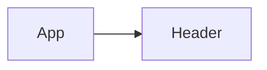
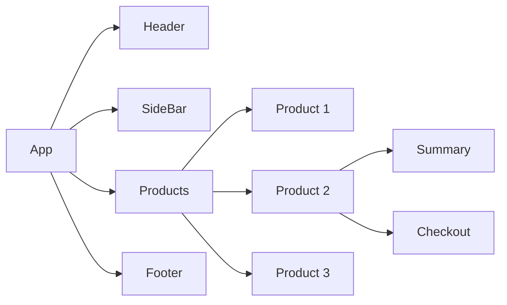

# Notes on react

---

- Components - React apps are built using components. Key concept in React
  - Any website or app can be broken down into components.
  - It can also therefore be built by creating and combining such components.
- A React component is effectively a combination of HTML, CSS and JavaScript
  - Reusable building blocks - create small building blocks, compose the UI from them
    - If needed, reuse a building block.
  - Related code lives together - Related HTML, JS and possible CSS is stored together.
- Separation of concerns
  - Different components handle different data and logic
  - Vastly simplifies the process of working on complex apps
- **This concept is found in other frameworks including Angular and Vue**

---

Describe the target UI with JSX
- JavaScript Syntax Extension - Used to describe and create HTML elements in JavaScript in a declarative way

With React, you write declarative code
- You define the target HTML structure and UI - not the steps to get there
  - Browsers do not support JSX

- React projects come with a build process that transforms JSX code (behind the scenes) to code that does work in browsers

A component is really just a JavaScript function.

Component functions must follow two rules
- Name starts with uppercase character
  - The function name must start with an uppercase character
  - multi-word names should be written in PascalCase(e.g "MyHeader")
  - It is recommended to pick a name that describes the UI building block (e.g "Header" or "MyHeader")
- Returns "Render-able" Content
  - The function must return a value that can be rendered ("displayed on scree") by react.
  - In most cases: Return JSX: Also allowed: String, number, boolean, null, array of allowed values.

---

### A closer look: Components and File Extensions
- Extensions are used by the build process when the server is running. Only the build process cares.
  - May find applications that use .js with JSX code inside. Depends on the build process.

---

### How components get rendered

App - Root Component - The first component to be analysed and rendered by React

Header - Nested Component - A child component of its parent component (of the App component in this case)

Ends up with a component hierarchy

React combines the React components to the DOM Node Tree

---

Built-in Components vs Custom Components

Built-in Components
- Name start with a lowercase character
- Only valid, officially defined HTML elements are allowed
- Are rendered as DOM nodes by React (i.e. Displayed on the screen)

Custom Components
- Name start with uppercase character
- Defined by you "wraps" built-in or other customer components
- React "traverses" the component tree until it has only built-in components left

---

Outputting Dynamic Content in JSX

Static Content
- Content that's hardcoded into the JSX code
- Can't change at runtime
- Example <h1>Hello World!</h1>

Dynamic Content
- Logic that produces the actual value is added to JSX
- Content / value is derived at runtime
- Example <h1>{userName}</h1>

---

## Configuring Components With 'Props'

- React allows you to pass data to component via a concept called "Props"

---

## The Special "childrne" Prop

- React automatically passes a special prop named "children" to every custom component
- Content for "children" - The content between component opening and closing tags is used as a value for the special "children" prop
- This is known as "component composition"

### Children vs Props

- Using "children"
  - For components that take a single piece of renderable content, this approach is close to "normal HTML usage"
  - This approach is especially convenient when passing JSX code as a value to another component
- Using attributes
  - This approach makes sense if you have multiple smaller pieces of information that must be passed to a component
  - Adding extra props instead of just wrapping the component tags means "extra work"

---

## Common source of bugs

- By default, react components only execute only once
  - You have to "tell" React if a Component Should be executed again

### How React Check if UI Updates are Needed

- React compares the old output ("old JSX code") of your component function to the new output ("new JSX code") and applies any differences to the actual website UI

---

## The rules of hooks

1) Only call Hooks inside of component functions
2) Only call hooks on the top level. They cannot be nested inside control statements

- useState yields an array with two elements
- Manage data and "tell" React to re-execute a component function via React's useState() Hook
