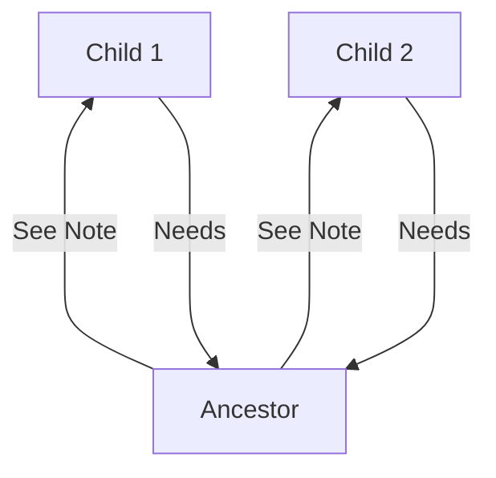

# Demo project deep dive notes

---

```javascript

setIsEditing(!isEditing);

```

- If your new state depends on your previous state value, you should not update the state like this.

----> *Instead*

```javascript

setIsEditing(wasEditing => !wasEditing);

```

- Instead, pass a function to your state updating function
- This function will automatically be called by React and will receive the guaranteed latest state value

---

## React schedules state updates

- State updates are no performed instantly but at some point in the future (when react has the time for it)
  - In most cases, those state updates are executed almost instantly

---

## Best Practices - Update Object-State immutably 

- Objectss and arrays (technically objects) are reference values in JavaScript
  - Therefore they should not be mutated directly, instead a deep copy should be created first.

```javascript

const updatedUser = user; // Not creating an object since 'user' is a reference value
    user.name = 'Max' // editing the value in memory here

const updatedUser = { ...user} // Creating a copy via JavaScript's "Spread" operator
    updatedUser.name = 'Max' // editing the copy, not the original

```

---

## Lifting state

- Lift the state up on the closest ancestor component that has access to all the components that need to work with that state.



- Ancestor passes a function that eventually changes the state via props to the child component
  - This allows the child component to initiate the state change
- Ancestor can also pass the state value via props to the child component

---

## General best practice

- Manage state as little as possible
  - Compute / derive values as much as possible